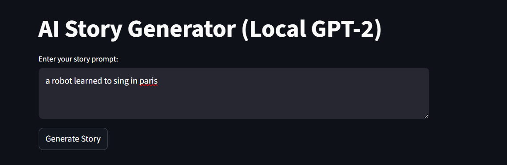
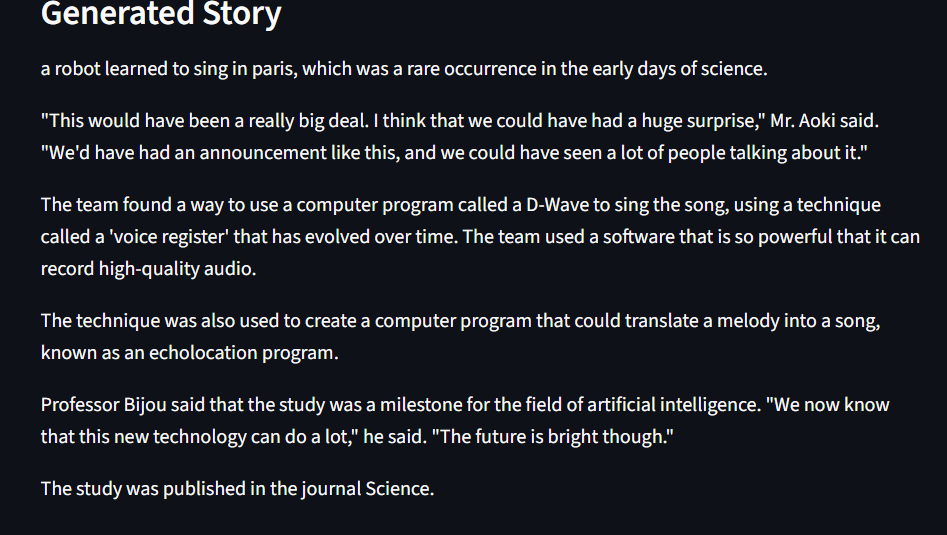

# AI Story Generator

This project implements an AI-powered story generator using Generative AI (GPT-2) and Streamlit.

---

## Features

- Generate creative, contextually relevant stories from any user prompt.
- Simple and interactive web interface using Streamlit.
- Fast, paragraph-length story generation.
- Easy to use: just enter a prompt and get a story instantly!

---

## How to Run

1. **Install dependencies:**
pip install streamlit transformers torch
2. **Start the app:**
streamlit run app.py
3. **Usage:**  
- Enter a story prompt in the web interface.
- View the generated story continuation.

---

## Example

**Input:**  
a robot learned to sing in paris
**Generated Story:**  
a robot learned to sing in paris, which was a rare occurrence in the early days of science.

"This would have been a really big deal. I think that we could have had a huge surprise," Mr. Aoki said. "We'd have had an announcement like this, and we could have seen a lot of people talking about it."

The team found a way to use a computer program called a D-Wave to sing the song, using a technique called a 'voice register' that has evolved over time. The team used a software that is so powerful that it can record high-quality audio.

The technique was also used to create a computer program that could translate a melody into a song, known as an echolocation program.

Professor Bijou said that the study was a milestone for the field of artificial intelligence. "We now know that this new technology can do a lot," he said. "The future is bright though."

The study was published in the journal Science.

---

## Screenshots
**App Home Page**

**Generated Story Example**

---

## Project Structure

- `app.py` – Main Streamlit application
- `requirements.txt` – Python dependencies
- `README.md` – Project documentation

---

## Results

- The system generates creative and contextually relevant stories for a variety of prompts.
- Handles both short and long prompts.
- Responsive interface with minimal delay.

---

## Author

- **Student Name:** srikar
- **College Name:** VIT-AP
- **Email:** srikarjami77@gmail.com

---

## License

This project is for educational purposes.
